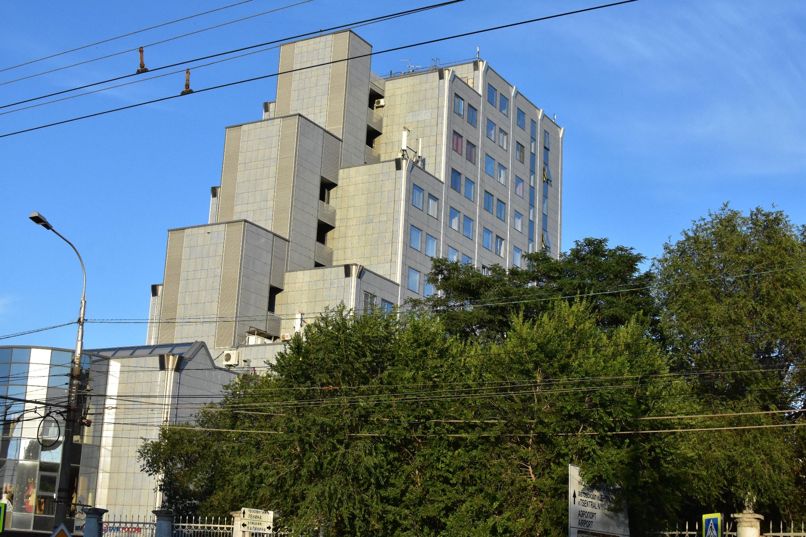
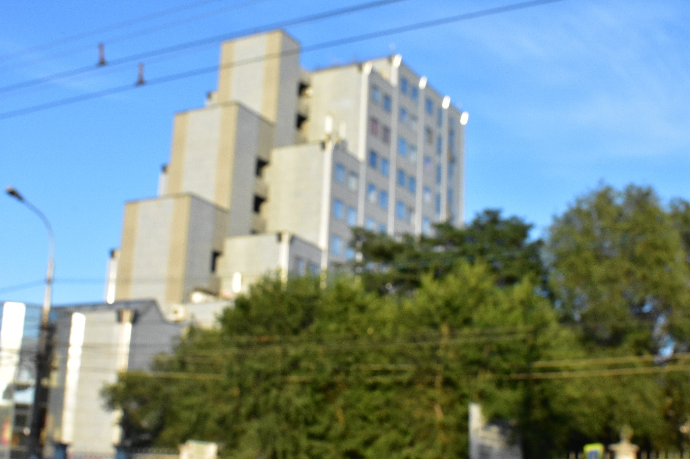
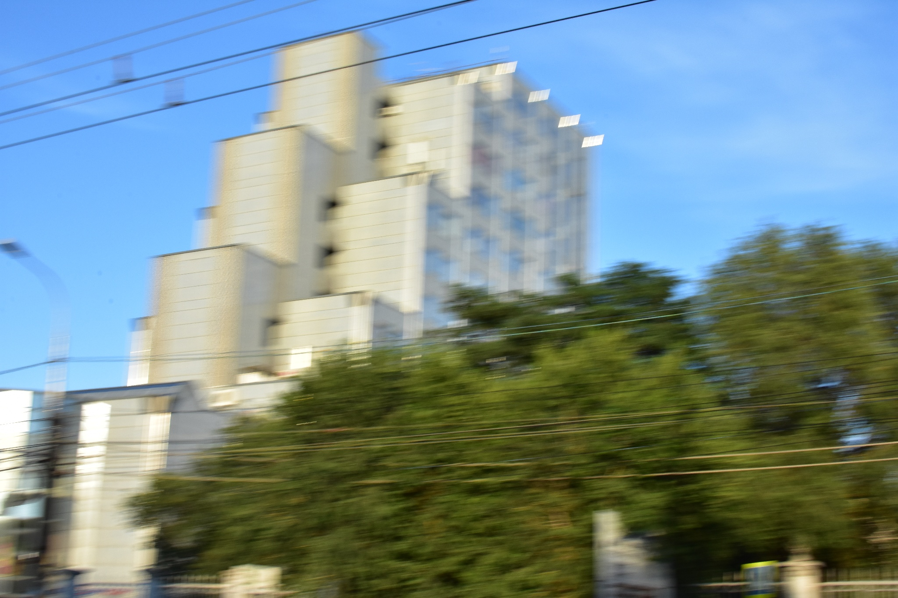
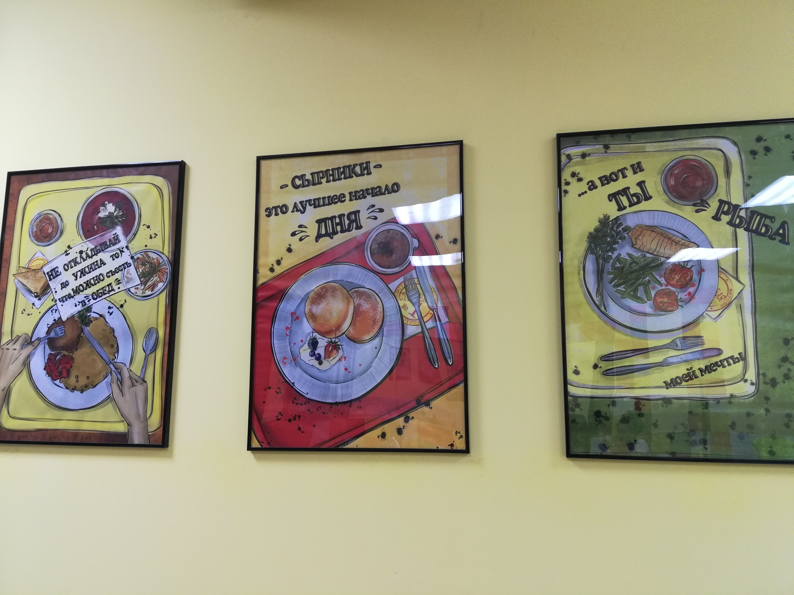
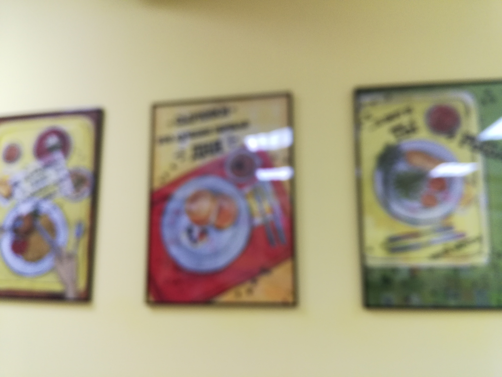
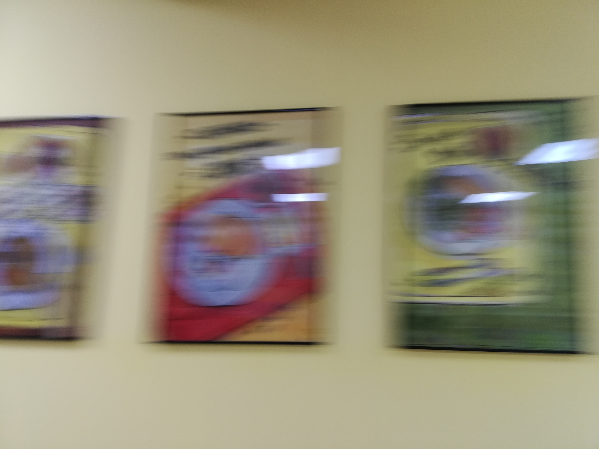
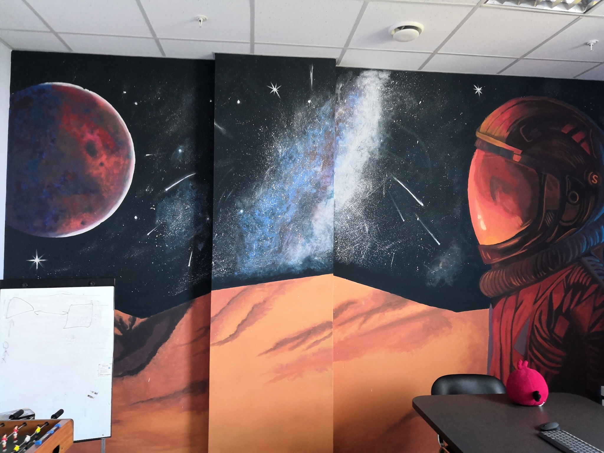
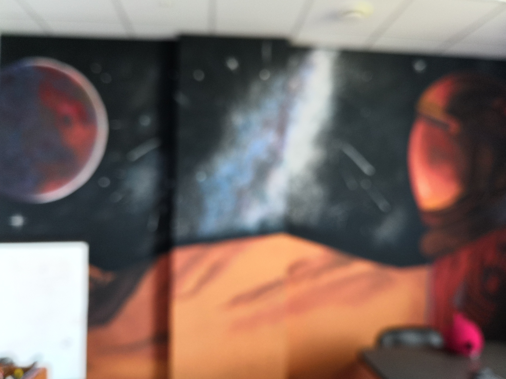
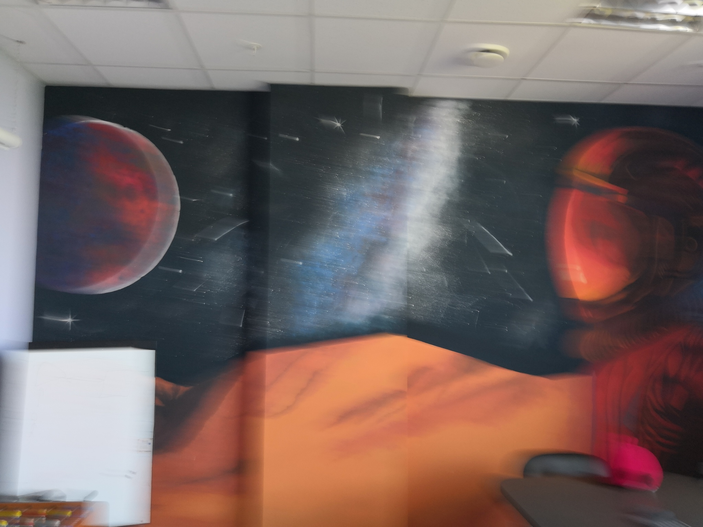

# Blur Dataset
## Description
This dataset contains 1050 blurred and sharp images (350 triplets), each image triplet is a set of three photos of the same scene: sharp, defocused-blurred and motion-blurred images.

The dataset was created to validate the blur detection algorithm. The dataset can also be used for testing image deblurring, hovewer, the triplets are not "pixel-to-pixel" images, so, one cannot compare blurred and sharp images on the basis of PSNR or SSIM but sharp images can be used for visual comparison.

## Dataset structure

The dataset contains three folders: sharp, defocused-blurred and motion-blurred images.

The filename structure is as follows: id_device_type.extension where
 - ID - a number from 0 to 349;
 - device - the image capture device;
 - type - one of [S, F, M]. S stands for Sharp image, F - deFocused-blurred image and M - Motion-blurred image.
          
The dataset contains 66 devices, these are typically smartphones, but several cameras are also provided.

 

List of devices:

 

|Device     | Amount|
|-----------|-------|
|HONOR-7X	| 37	|
|NIKON-D3400-18-55MM	| 37	|
|HONOR-8X	| 30	|
|IPHONE-SE	| 30	|
|NIKON-D3400-35MM	| 25	|
|XIAOMI-PROCOFONE-F1	| 23	|
|IPHONE-7	| 13	|
|IPHONE-6S	| 11	|
|XIAOMI-MI8-SE	| 9	|
|HONOR-10	| 8	|
|ASUS-ZENFONE-LIVE-ZB501KL	| 6	|
|HONOR-7C	| 6	|
|HUAWEI-P20-LITE	| 6	|
|SONY-NEX-5T	| 6	|
|XIAOMI-REDMI-7	| 6	|
|HUAWEI-P20	| 5	|
|IPHONE-8-PLUS	| 5	|
|SAMSUNG-GALAXY-J3	| 5	|
|HUAWEI-MATE20	| 4	|
|HUAWEI-Y9	| 4	|
|IPHONE-8	| 4	|
|CANON-6D-100MM	| 3	|
|HONOR-9	| 3	|
|HUAWEI-NOVA-LITE	| 3	|
|IPHONE-7-PLUS	| 3	|
|SAMSUNG-GALAXY-A8	| 3	|
|SAMSUNG-GALAXY-J5	| 3	|
|WILEYFOX-SWIFT-2-PLUS	| 3	|
|XIAOMI-REDMI-3S	| 3	|
|XIAOMI-REDMI-NOTE-7	| 3	|
|HONOR-6X	| 2	|
|HUAWEI-P30-PRO	| 2	|
|ONEPLUS-3T	| 2	|
|SAMSUNG-GALAXY-A5	| 2	|
|SAMSUNG-GALAXY-A6	| 2	|
|SAMSUNG-GALAXY-J7	| 2	|
|XIAOMI-REDMI-5-PLUS	| 2	|
|ASUS-ZE500KL	| 1	|
|BQ-5512L	| 1	|
|CANON-6D-70-200MM	| 1	|
|HONOR-4C	| 1	|
|HONOR-8	| 1	|
|HONOR-9-LITE	| 1	|
|HUAWEI-P-SMART	| 1	|
|HUAWEI-P30	| 1	|
|HUAWEI-P30-LITE	| 1	|
|IPHONE-5S	| 1	|
|IPHONE-6	| 1	|
|IPHONE-XR	| 1	|
|LG-Q6	| 1	|
|NOKIA-21	| 1	|
|PANASONIC-DMC-TZ35	| 1	|
|PRESTIGIO-MULTI-PHONE	| 1	|
|SAMSUNG-EDGE-7C	| 1	|
|SAMSUNG-GALAXY-7-NEO	| 1	|
|SAMSUNG-GALAXY-A3	| 1	|
|SAMSUNG-GALAXY-GRAND-PRIME	| 1	|
|SAMSUNG-GALAXY-GRAND-PRIME-PLUS	| 1	|
|SAMSUNG-GALAXY-S5	| 1	|
|SONY-XPERIA-E5	| 1	|
|XIAOMI-MI8-LITE	| 1	|
|XIAOMI-REDMI-4	| 1	|
|XIAOMI-REDMI-4A	| 1	|
|XIAOMI-REDMI-4X	| 1	|
|XIAOMI-REDMI-NOTE-4X	| 1	|
|XIAOMI-REDMI-NOTE-5A-PRIME	| 1	|

 

## Download
Kaggle dataset (images were scaled to 2048 pixels by the widest side): https://www.kaggle.com/kwentar/blur-dataset

Google drive (source images): https://drive.google.com/open?id=1RObmCDPeQ1Lg-V6u7dT02Pf0qH-QMcTp

Mirror: https://yadi.sk/d/_Wli3wSSScnzCg

## Samples

|Sharp     | Defocused-blurred | Motion-blurred |
|-----------|-------|-------|
|| | |
|| | |
|| | |

## Licence
will be soon

## How to cite
will be soon

